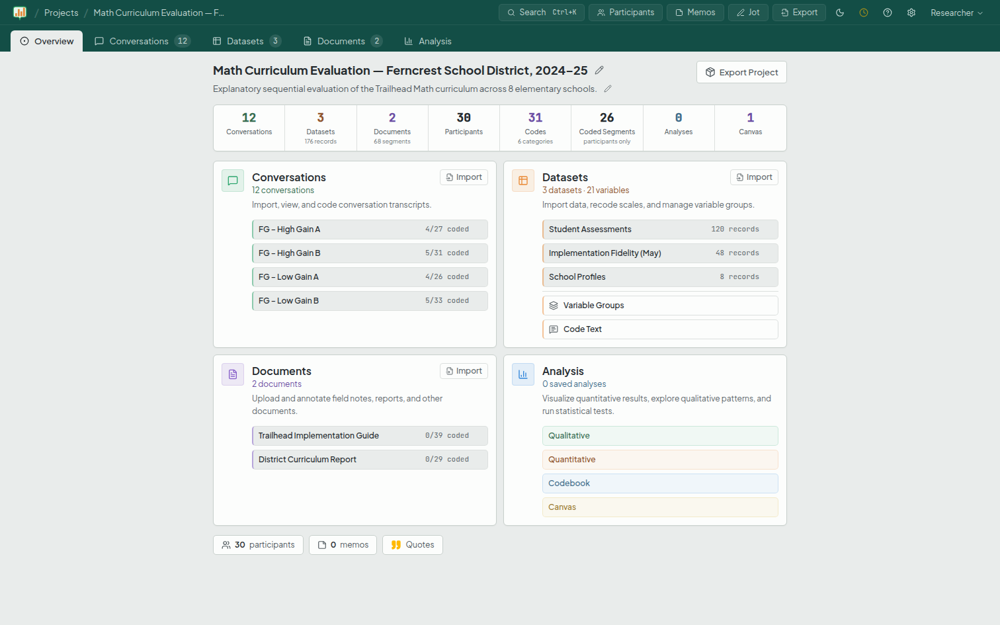
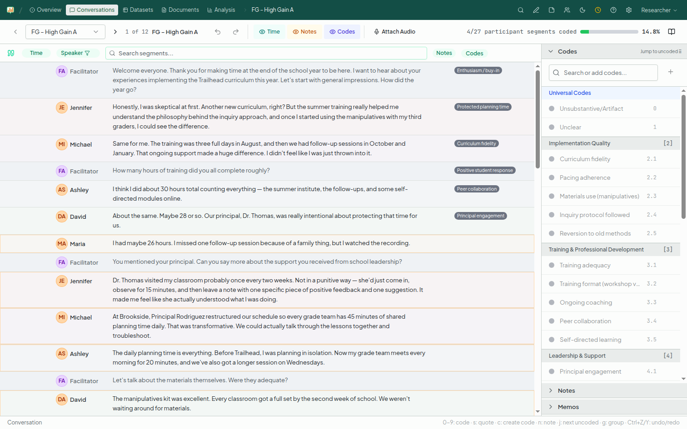
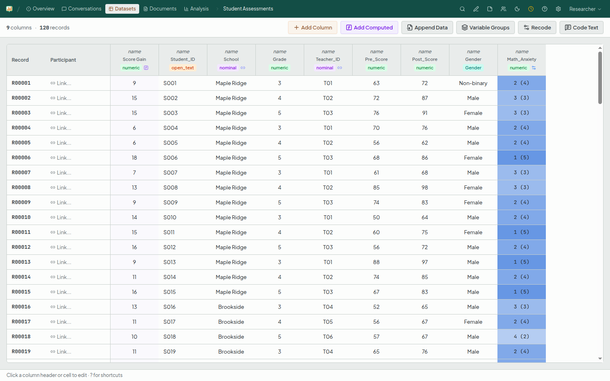
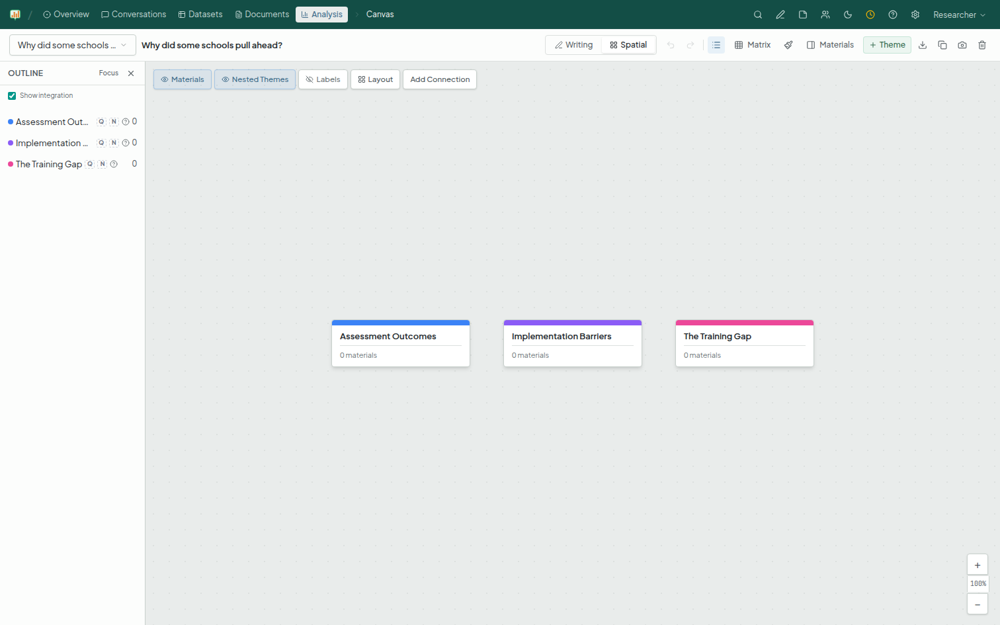

# Mixed Measures

**A local-first desktop workspace for mixed-methods research — qualitative and quantitative data in one project, with shared participants, codes, and memos.**

[](LICENSE)
[](https://github.com/gfchavez28/mixedmeasures/actions/workflows/ci.yml)




<table>
  <tr>
    <td width="33%"></td>
    <td width="33%"></td>
    <td width="33%"></td>
  </tr>
  <tr>
    <td align="center"><sub><b>Qualitative coding</b></sub></td>
    <td align="center"><sub><b>Quantitative data</b></sub></td>
    <td align="center"><sub><b>Integration canvas</b></sub></td>
  </tr>
</table>

---

## The problem

Researchers who work across both interviews *and* surveys end up living in two
disconnected tools: a qualitative coding app for transcripts and documents, and a
statistics package for the numbers. The integration — the part that actually makes
it *mixed* methods — happens by hand, in a separate document, with no shared
participants, no shared codebook, and no through-line from a survey item to the
quote that explains it.

Mixed Measures keeps both kinds of data in a single project. The same participant
can be a survey respondent *and* an interview speaker. A code applies to a transcript
segment *and* to an open-ended survey response. And an integration workspace (the
**Canvas**) lets you write up findings with live excerpts, memos, and analysis
results embedded inline.

It is built for independent consultants, program evaluators, and applied
researchers who need rigor without an enterprise license — and who want their data
to stay on their own machine.

## Install

**Recommended:** download the latest signed installer for Windows or macOS from the
[Releases page](https://github.com/gfchavez28/mixedmeasures/releases/latest) and run
it — no setup required. (Installers are attached to each `v1.0`+ release tag; if
Releases looks empty during the initial launch, the first signed build is on the
way.) Prefer to build it yourself? See [Running from source](#running-from-source).

**First launch — a security prompt is expected.** The installers are signed (and
notarized on macOS), so the verified publisher is **George Chavez**. Because Mixed
Measures is a new, independent app, your operating system may still show a first-run
warning until the app builds up download reputation — this is normal and does not
mean anything is wrong:

- **Windows** — if you see *"Windows protected your PC"* (SmartScreen), click
  **More info → Run anyway**, confirming the publisher reads *George Chavez*. (A code
  signature verifies the publisher and that the file hasn't been tampered with; it
  does not by itself suppress SmartScreen for a newly released app — that reputation
  is earned as more people download it.)
- **macOS** — the app is notarized, so it should open normally. If it doesn't,
  right-click the app → **Open**.

## What it does

### Bring data in
- **Datasets** — import survey/quantitative data from **CSV**, with automatic
  column-type detection (Likert/scale, numeric, percentage, binary, categorical),
  scale-pattern recognition, and N/A / refusal-label handling. Append additional
  rows from another CSV.
- **Documents** — import **`.docx`, `.pdf`, and `.txt`** files; they're
  auto-segmented (with page numbers and headings) for coding.
- **Conversations** — import transcripts as **CSV** (speaker- and timestamp-aware,
  e.g. exports from common transcription tools), with optional **audio** (`.mp3`,
  `.m4a`, `.wav`) attached for synchronized playback while you code.

### Code and analyze qualitatively
- Three coding surfaces — for **conversations**, **documents**, and **open-ended
  text columns** in datasets — sharing one keyboard-driven coding layer.
- A structured **codebook** (codes, categories, universal codes), coded-segment
  tracking, **excerpts** and a **Quote Board**, **memos**, **notes**, and a
  quick-capture **Scratchpad**.
- **Participants** and **speakers** form a shared cross-source identity spine, so a
  person links across their survey record and their interview.
- Qualitative analysis: code frequencies, **co-occurrence**, a **thematic
  saturation curve**, group comparisons of code frequency, and a force-directed
  **codebook network** view.

### Analyze quantitatively
- Descriptives (means, SDs, frequencies, proportions).
- Comparisons: **Welch's t-test**, **one-way ANOVA** with **Tukey HSD** post-hoc,
  and non-parametric **Mann-Whitney U** / **Kruskal-Wallis H**, with effect sizes
  (Cohen's *d*, η², ω², ε²).
- **Correlation matrices** (Pearson / Spearman) with scatter matrix and trendlines.
- **Cross-tabulation** with chi-square and Cramér's V.
- **Reliability**: Cronbach's alpha and split-half (Spearman-Brown corrected).
- **Missing-data diagnostics**: missingness summary, pattern view, and Little's MCAR
  test.
- **Computed columns** via a safe expression language (`[Post] - [Pre]`,
  `IF(...)`, `MEAN(...)`, `COALESCE(...)`, etc.).
- **Crosswalk** — harmonize variables that were measured differently across
  datasets into equivalence groups and analysis domains, then compute scale scores
  across instruments. This is the workspace's strongest differentiator for
  multi-instrument survey work.

### Integrate
- The **Canvas** is a theme-based integration workspace with **Writing** and
  **Spatial** modes, rich-text prose (Tiptap), inline embeds of excerpts /
  materials / memos, typed relationships between themes, versioned snapshots, and a
  Convergence Matrix view for triangulating findings.

### Export and reproduce
- **CSV** and **Excel** (`.xlsx`) of data and results.
- A **runnable R script** (`.R`) that reproduces the tool's own statistics in R
  (t-test, ANOVA + Tukey, correlations, chi²/Cramér's V, Mann-Whitney,
  Kruskal-Wallis, Cronbach's alpha, split-half, descriptives) — verified by a
  round-trip test that R's numbers match the app's.
- **Canvas export** to Word (`.docx`), HTML, and PDF, with charts embedded as
  images.
- **`.mmproject`** — a complete, database-agnostic project archive for moving a
  whole project between machines or instances.

## What it is *not*

Being honest about scope:

- **Not collaborative.** A project is owned by exactly one researcher. There is
  no project sharing, no real-time co-editing, and no team workspace. For
  separate researchers on one shared computer, use separate operating-system
  accounts — each gets its own fully separate data. Multi-coder support with
  intercoder reliability (Cohen's kappa, Krippendorff's alpha) is on the roadmap.
- **Not cloud-based.** Everything runs locally against a local database. Moving a
  project between machines is a manual file transfer (`.mmproject` / backup).
- **No AI in the product.** The shipping tool currently has no AI/LLM features — it
  doesn't analyze your data, write your findings, or send anything anywhere. Every
  result comes from a conventional, documented method you can inspect and check
  (classical statistics via SciPy / statsmodels, not ML inference). AI assistance may
  be considered later, but not in v1.0. *(AI coding tools did assist in **building**
  Mixed Measures — an honest note about development, distinct from what the product
  does.)*
- **Not a full statistical-modeling suite.** Regression and factor analysis are not
  in v1.0; for analysis beyond the built-in descriptives and comparisons, export
  the R script and continue there.

## Privacy & your data

- **Fully local and offline.** The app makes no outbound network calls — no
  telemetry, no analytics, no update checks, no external CDNs (fonts are
  self-hosted). The browser content-security-policy is locked to `self`.
- **No accounts, no sign-in.** The desktop app opens straight into your workspace
  as a single local researcher — there is no login screen or password. Your
  operating-system account is the security boundary; an optional inactivity
  timeout is available for shared computers.
- **The database is encrypted at rest in the desktop app.** Packaged builds
  encrypt the SQLite database with SQLCipher (AES-256), using a random
  per-install key held in your OS keychain (macOS Keychain / Windows DPAPI /
  Linux Secret Service) — a copied or synced database file is unreadable without
  it. If no OS keychain is available, the app says so plainly and runs
  unencrypted rather than storing a key insecurely. Two honest limits: inside a
  `.mmbackup` archive the database is ciphertext but documents/media are not,
  and encryption does not defend against software already running as *your* OS
  user — full-disk encryption (FileVault / BitLocker) is the answer there.
  Development builds run from source use a plaintext database for
  inspectability. See [SECURITY.md](SECURITY.md) for the full posture.
  **If your data is sensitive, also store it on an encrypted disk / user profile
  and keep backups somewhere correspondingly protected.**

## Tech stack

| Layer | Technology |
|-------|------------|
| Backend | FastAPI + SQLAlchemy 2.0 (Python 3.12) |
| Database | SQLite (Alembic migrations) |
| Frontend | React 19 + Vite + TypeScript |
| UI | shadcn/ui + Tailwind CSS v4 |
| Data fetching | TanStack Query |
| Rich text | Tiptap |
| Charts | Recharts + d3-force |
| Statistics | SciPy + statsmodels (lazy-imported) |
| Parsing | python-docx, pdfminer.six, tinytag (all permissive) |

## Running from source

Most users should install the signed desktop build (see [Install](#install) above).
To develop, contribute, or build it yourself, run the backend and frontend together:

**Prerequisites**
- Python 3.12+
- Node.js 20+ (current LTS)

**Backend** (FastAPI, port 8000):

```bash
cd backend
python -m venv venv && source venv/bin/activate   # Windows: venv\Scripts\activate
pip install -r requirements.txt
alembic upgrade head        # create / migrate the local SQLite database
uvicorn app.main:app --reload --port 8000
```

**Frontend** (Vite dev server, port 5173, proxies `/api` to the backend):

```bash
cd frontend
npm ci
npm run dev
```

Open **http://localhost:5173**. The app opens straight into the workspace as a
local researcher (no account setup), and you can create your first project.

Configuration is via environment variables (all optional; sensible local defaults).
Common ones — see `backend/app/config.py` for the full list:

| Variable | Default | Purpose |
|----------|---------|---------|
| `MM_DATABASE_PATH` | `dev.db` | SQLite database file |
| `MM_DATA_DIR` | `data` | Parent of `documents/` and `media/` |
| `MM_BACKUP_DIR` | `backups` | Backup storage |
| `INACTIVITY_TIMEOUT_MINUTES` | `0` (off) | Auto-logout on a shared machine (e.g. `30`) |
| `COOKIE_SECURE` | `false` | Set `true` when serving over HTTPS |

## Tests

```bash
# Backend
cd backend && source venv/bin/activate
pip install -r requirements-dev.txt
python -m pytest tests/

# Frontend
cd frontend && npm test
```

See [CONTRIBUTING.md](CONTRIBUTING.md) for the full development workflow, migration
guidance, and dependency policy.

## Backups & data safety

Qualitative coding is irreplaceable manual work, so the app keeps several backup
mechanisms: automatic pre-migration backups, periodic auto-backups, and
user-triggered `.mmbackup` archives (database + documents + media) with a
validate-and-preview restore flow. Back up regularly, and keep a copy off the
working machine.

## License

Licensed under the **Apache License, Version 2.0** — see [LICENSE](LICENSE) and
[NOTICE](NOTICE). Copyright © 2026 George Chavez.

Mixed Measures is provided **"as is", without warranty of any kind** (see the
license for the full disclaimer). It is a research aid, not a certified statistical
authority: **verify analyses against your own judgment and, where it matters, an
independent tool** before relying on them in deliverables or decisions.

"Mixed Measures" is used as a common-law trademark of the project author.

## Contributing & security

- Development setup and conventions: [CONTRIBUTING.md](CONTRIBUTING.md)
- Reporting a vulnerability: [SECURITY.md](SECURITY.md)
